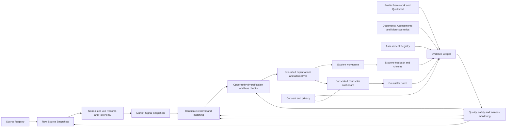
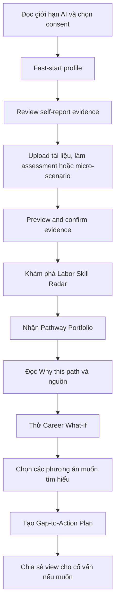

# Thiết kế BA — Hệ thống hướng nghiệp theo tín hiệu thị trường lao động

## 1. Product thesis

Sản phẩm giúp học sinh khám phá nhiều lộ trình học tập–nghề nghiệp có căn cứ bằng cách kết hợp:

1. tín hiệu kỹ năng từ dữ liệu tuyển dụng có nguồn, thời điểm và độ tin cậy;
2. hồ sơ năng lực–sở thích được xây dần qua tương tác và minh chứng;
3. tập lộ trình đại học và giáo dục nghề nghiệp có thể so sánh, giải thích và thay đổi được.

Đây là decision-support system, không phải máy phán nghề. Sản phẩm thành công khi học sinh hiểu
thêm lựa chọn, biết bước tiếp theo và vẫn cảm thấy quyết định thuộc về mình; cố vấn có thêm bằng
chứng để tổ chức một cuộc trao đổi tốt hơn.

## 2. Scope and personas

### 2.1 Primary scope

- Web responsive, tối ưu cho học sinh lớp 10–12.
- Hỗ trợ các độ tuổi khác bằng cùng mô hình hồ sơ; tuổi không phải điều kiện loại nghề.
- Pilot tại Việt Nam, ưu tiên tiếng Việt và dữ liệu tuyển dụng có thể truy vết.

### 2.2 Personas

| Persona | Goal | Product authority |
|---|---|---|
| Học sinh | Hiểu bản thân, khám phá lựa chọn, lập bước tiếp theo | Sở hữu hồ sơ, chia sẻ và quyết định cuối cùng |
| Cố vấn hướng nghiệp | Chuẩn bị và dẫn dắt phiên tư vấn dựa trên bằng chứng | Xem khi được cấp quyền, nhận xét; không sửa quyết định |
| Data/AI steward | Duy trì nguồn, taxonomy, chất lượng và fairness | Tạm dừng nguồn/model; không xem hồ sơ không cần thiết |
| Quản trị pilot | Theo dõi adoption và outcome tổng hợp | Chỉ xem dữ liệu cohort đã tối thiểu hóa/ẩn danh |

### 2.3 Out of scope for MVP

- Tự động tuyển sinh, nộp hồ sơ hoặc bảo đảm việc làm/lương.
- Chẩn đoán tâm lý, xếp hạng học sinh hoặc một "personality type" cố định.
- Dùng giới, quê quán, dân tộc, hoàn cảnh kinh tế để hạ/xóa cơ hội.
- Tư vấn pháp lý, y khoa hoặc tài chính cá nhân.
- Marketplace khóa học, quảng cáo hoặc bán dữ liệu học sinh.

## 3. Business capability architecture

## 4. Proposed features

### 4.1 P0 — Demo and pilot MVP

#### F-01. Labor Skill Radar

Hiển thị `Market Signal Snapshot` về demand intensity/growth theo nghề, kỹ năng, khu vực và thời
gian. Chỉ dùng nhãn shortage khi có thêm evidence phía cung hoặc hiring difficulty; cho phép
drill-down từ signal → metric → sample → source snapshot.

**Acceptance signals**:
- Nghề, kỹ năng, lương, vùng và thời gian được chuẩn hóa từ ≥ 3 nguồn pilot.
- Mọi metric có sample size, freshness, confidence và provenance.
- Không dùng số phần trăm khi mẫu dưới ngưỡng; hiển thị `insufficient data`.
- Benchmark extraction có gold set và baseline từ khóa.
- Trend không dựa riêng raw posting count; dùng demand share, rolling windows, source-mix stability
  và seasonality check.
- Shortage claim thiếu supply evidence phải bị chặn hoặc đổi thành "nhu cầu tuyển dụng cao".

#### F-02. Profile Framework & Living Profile Fast-start

`Profile Framework` định nghĩa sáu nhóm: ability/skill, activity interest, work values, goals and
exploration state, context/preferences và evidence coverage. Học sinh bắt đầu bằng quickstart 7–10
câu trong khoảng 5 phút; mỗi câu tạo self-report evidence thay vì ghi thẳng kết luận.

**Acceptance signals**:
- Quickstart bao phủ mục tiêu, hoạt động thích làm/tự tin, trải nghiệm, giá trị, hình thức học,
  thời gian/chi phí/di chuyển, route openness và khu vực muốn khám phá.
- `Derived Profile Snapshot` có version, confidence, conflicts và evidence references.
- Tách `self-reported`, `document`, `assessment`, `interaction`, `counselor-note`, `AI-inference`.
- Không sinh một nhãn tính cách tổng quát hoặc coi câu trả lời đầu tiên là cố định.

#### F-03. Evidence & Assessment Hub

Một bề mặt thống nhất để học sinh bổ sung evidence bằng tài liệu được chủ động chia sẻ, assessment
có nguồn tin cậy và micro-scenario. Dữ liệu chỉ ảnh hưởng profile sau khi người dùng preview,
chỉnh sửa hoặc xác nhận.

**Acceptance signals**:
- Upload flow gồm PII detection → candidate evidence extraction → preview/edit/reject → confirm →
  lựa chọn giữ/xóa raw file.
- Evidence Ledger lưu source/ref, claims, scale, collected time, confidence, visibility, consent,
  user confirmation, retention và supersession.
- Assessment Registry lưu provider/source, license, version, construct, scale, norm group,
  reliability/limitations và validity window.
- Assessment result giữ raw/max score; chỉ dùng percentile khi norm group phù hợp; không so trực
  tiếp điểm giữa hai assessment khác construct/scale.
- Micro-scenario có skip/accessibility; không chấm "có tố chất", chỉ thêm evidence và confidence.

#### F-04. Pathway Portfolio

Trả về một danh mục lựa chọn thay vì top-1: university, college, vocational/intermediate training,
apprenticeship/certificate và các bước khám phá ngắn hạn khi dữ liệu có sẵn.

**Acceptance signals**:
- Mỗi lần hiển thị ≥ 3 họ lộ trình khả thi và phương án gần kề.
- Ít nhất một tuyến nghề được cân nhắc ngang hàng khi phù hợp và có dữ liệu.
- Không loại nghề do giới, tuổi hoặc địa phương; điều kiện địa lý là preference có thể thay đổi.

#### F-05. "Why this path?" Evidence Card

Mỗi lộ trình tách rõ: phù hợp với hồ sơ nào, tín hiệu thị trường nào, dữ liệu còn thiếu, khoảng trống
kỹ năng, uncertainty, nguồn và thời điểm.

**Acceptance signals**:
- Fact có citation; inference được gắn nhãn; suggestion dùng ngôn ngữ tham khảo.
- Không có nguồn thì không tạo market claim.
- Học sinh có thể chọn "không đúng với tôi" và xem output thay đổi vì sao.

#### F-06. Career What-if Sandbox

Học sinh thử thay đổi preference hoặc mục tiêu: mở rộng bán kính, ưu tiên chi phí thấp, muốn đi làm
sớm, muốn học đại học, thêm kỹ năng hoặc thử một hoạt động; hệ thống cho biết lựa chọn và lý do thay đổi.

**Acceptance signals**:
- Không ghi đè hồ sơ gốc nếu chưa xác nhận.
- Hiển thị delta của assumptions và recommendations.
- Không cho phép thay giới tính để tối ưu kết quả; demographic chỉ dùng audit có consent.

#### F-07. Skill Gap-to-Action Plan

Biến khoảng trống thành các bước 30/60/90 ngày: kỹ năng cần khám phá, hoạt động thực hành, câu hỏi
cho cố vấn và bằng chứng nên bổ sung. Không cam kết khóa học hoặc cơ hội cụ thể khi chưa xác minh.

**Acceptance signals**:
- Mỗi action liên kết với một gap và lộ trình.
- Cho phép đánh dấu, điều chỉnh, bỏ qua và ghi nhận học được gì.

#### F-08. Opportunity Expansion Guardrail

Rerank để giữ relevance nhưng bảo đảm đa dạng ngành, hình thức học, mức đầu tư và phương án địa lý.
Chạy counterfactual test và phát hiện nghề triển vọng bị thiếu exposure ở cohort.

**Acceptance signals**:
- Giới và vùng không phải negative ranking features.
- Counterfactual consistency được đo trên mỗi model release.
- Guardrail tạo log giải thích khi thêm phương án cơ hội.
- Dữ liệu vùng thưa dẫn tới cảnh báo và tùy chọn mở rộng, không suy thành "không có cơ hội".

#### F-09. Student-controlled Counselor Workspace

Dashboard hiển thị profile summary, lộ trình đang cân nhắc, câu hỏi mở, evidence card và action plan.
Học sinh cấp/thu hồi quyền; cố vấn nhận xét và cùng so sánh nhưng không thay quyết định.

**Acceptance signals**:
- Field-level hoặc view-level consent; revoke có hiệu lực và audit log.
- Counselor note được phân biệt với student statement và AI inference.
- Không có nút "assign career" hoặc thay đổi preference của học sinh.

#### F-10. Trust & Data Panel

Cho học sinh/cố vấn xem dữ liệu đến từ đâu, cập nhật khi nào, coverage bao nhiêu, giới hạn gì và cách
AI tham gia. Cho data steward xem source health, lỗi chuẩn hóa và model version.

**Acceptance signals**:
- Có data/model card và version cho output demo.
- Hiển thị degraded/stale state; không âm thầm dùng dữ liệu cũ.

#### F-11. Pilot Feedback Loop

Thu thập usefulness, comprehension, lựa chọn mới phát hiện, confidence trước–sau và feedback "not
for me"; cung cấp cohort analytics đã tối thiểu hóa dữ liệu cho pilot owner.

**Acceptance signals**:
- Không dùng feedback để tự động tái huấn luyện khi chưa review.
- Dashboard tách product metric khỏi fairness slices và qualitative evidence.

#### P0 foundational work packages

Các work package sau là điều kiện để 11 feature P0 hoạt động đúng; chúng không nhất thiết tạo thêm
màn hình riêng.

| ID | Deliverable | Exit evidence |
|---|---|---|
| P0-PROFILE-01 | Versioned Profile Framework | Schema review; không có demographic ranking field |
| P0-PROFILE-02 | Quickstart 7–10 câu → self-report evidence | Completion test; answer-to-evidence trace |
| P0-EVIDENCE-01 | Evidence Ledger + consent/delete/export | CRUD, audit, revoke và rebuild tests |
| P0-EVIDENCE-02 | Document upload/review flow | PII warning; preview/edit/reject; raw retention choice |
| P0-ASSESS-01 | Assessment Registry + result adapter | License/version/scale/norm validation; invalid percentile blocked |
| P0-PROFILE-03 | Derived Profile Snapshot | Confidence/conflict/evidence refs; deterministic rebuild |
| P0-MARKET-01 | Source Registry + Raw Source Snapshots | Source rights/freshness card; reproducible snapshot |
| P0-MARKET-02 | Normalized Job Records + taxonomy | Gold-set F1, dedup và mapping benchmark |
| P0-MARKET-03 | Market Signal Snapshot | Window/share/sample/confidence/provenance và shortage claim test |
| P0-TRUST-01 | Claim/citation validator + degraded modes | Ungrounded claim blocked; stale/sparse/model-down tests |

### 4.2 P1 — Sau khi MVP chứng minh core loop

- So sánh hai hoặc ba lộ trình side-by-side theo thời gian, chi phí, điều kiện và skill demand.
- Regional mobility/remote opportunity explorer do học sinh chủ động bật.
- Kết nối portfolio/evidence provider bên ngoài sau privacy và licensing review.
- Counselor cohort workspace cho trường với consent và dữ liệu tổng hợp.
- Notification khi market signal thay đổi đáng kể, kèm lý do và opt-out.
- Taxonomy review tool và active-learning queue cho data steward.

### 4.3 P2 — Không đưa vào demo đầu

- Marketplace chương trình đào tạo, matching doanh nghiệp hoặc job application.
- Mô hình dự báo dài hạn cấp cá nhân.
- Parent portal; chỉ xem xét sau nghiên cứu quyền tự chủ và consent.
- Native mobile app; web responsive đủ cho pilot.

## 5. Key user journeys

### 5.1 Student golden path

### 5.2 Counselor session

1. Nhận quyền truy cập có thời hạn từ học sinh.
2. Xem tóm tắt nguồn/confidence và câu hỏi chưa rõ, không chỉ xem ranking.
3. So sánh các lộ trình cùng học sinh và kiểm tra market evidence.
4. Thêm nhận xét/câu hỏi; học sinh xác nhận action plan.
5. Gửi usefulness feedback; quyền truy cập có thể hết hạn hoặc bị thu hồi.

### 5.3 Data steward loop

1. Đăng ký nguồn và quyền sử dụng.
2. Chạy ingest, quality/dedup/normalization và benchmark.
3. Quản lý taxonomy và Assessment Registry: license, version, scale, norm group, limitation.
4. Review low-confidence mappings, coverage gaps và shortage claim evidence.
5. Phát hành Market Signal Snapshot/model/taxonomy version.
6. Theo dõi incident, fairness và rollback/tạm dừng nguồn khi cần.

## 6. Data and AI design

### 6.1 Labor signal pipeline

`Source Registry → Raw Source Snapshot → validation/dedup → structured extraction → Normalized Job Record → occupation-skill taxonomy → salary/time/region normalization → aggregation → Market Signal Snapshot → signal API`

AI phù hợp cho extraction, synonym/entity mapping và review queue; quy tắc xác định dùng cho đơn vị,
thời gian, privacy, sample threshold và provenance. Tất cả bước phải versioned và benchmark được.

`Market Signal Snapshot` tối thiểu gồm occupation, optional skill, region, time window, valid posting
count, demand share, growth rate, salary distribution, sample size, source mix, confidence, freshness,
methodology version và provenance references. Trend dùng tỷ trọng và rolling windows thay vì raw count
đơn lẻ. `Skill shortage` cần supply/hiring-difficulty evidence; nếu không có, API/UI chỉ trả demand signal.

### 6.2 Profile Framework

Profile Framework là schema được version hóa, không phải hồ sơ của một học sinh. Các dimension:

| Group | Meaning | Matching rule |
|---|---|---|
| ability/skill | Năng lực/kỹ năng có self-report hoặc evidence | Dùng estimate + confidence, không dùng verdict |
| activity interest | Hoạt động người học muốn làm/khám phá | Preference có thể thay đổi |
| work values | Ổn định, tự chủ, sáng tạo, tác động, thu nhập... | User-controlled weights |
| goals/exploration state | Mục tiêu và trạng thái đang tìm hiểu/so sánh/thử nghiệm | Điều chỉnh UX/action, không khóa nghề |
| context/preferences | Thời gian, chi phí, địa lý, hình thức học | Constraint/preference có thể thay đổi |
| evidence coverage | Mức đầy đủ, recency và conflict của evidence | Điều chỉnh confidence và câu hỏi tiếp theo |

Protected/sensitive attributes không thuộc matching dimensions. Nếu thu thập để fairness audit phải
có consent riêng, minimum cohort size và tách storage/access.

### 6.3 Evidence Ledger

| Field | Meaning |
|---|---|
| `evidence_id` | Stable ID của evidence event |
| `source_type` | self-report, document, assessment, interaction, counselor-note, AI-inference |
| `source_ref` | Câu hỏi, file/excerpt, assessment/version hoặc interaction tạo evidence |
| `claims` | Một hoặc nhiều dimension/value/scale được evidence hỗ trợ |
| `confidence` | Mức chắc chắn, không phải điểm giá trị con người |
| `collected_at` | Thời điểm thu thập/quan sát |
| `visibility` | private, shared-with-counselor, aggregated-for-pilot |
| `consent_scope` | Mục đích xử lý và phạm vi chia sẻ |
| `user_confirmed` | User đã preview/chấp nhận evidence hay chưa |
| `retention` | Chính sách giữ/xóa raw artifact |
| `supersedes` | Evidence mới thay evidence cũ nhưng vẫn audit được |

Evidence Ledger là source-of-truth dạng append/audit; sửa logical tạo version/supersession thay vì
âm thầm thay nội dung. Tài liệu upload không tạo evidence active trước khi user confirm.

### 6.4 Assessment Registry

| Field | Meaning |
|---|---|
| `assessment_id`, `version` | Định danh đúng bài và phiên bản |
| `provider`, `source`, `license` | Nguồn và quyền sử dụng |
| `construct` | Khái niệm bài đánh giá thực sự đo |
| `scale` | Raw/min/max và scoring method |
| `norm_group` | Population dùng tính percentile, nếu có |
| `reliability_validity` | Bằng chứng đo lường và giới hạn |
| `validity_window` | Thời gian kết quả còn phù hợp để tham khảo |

Assessment result lưu raw/max score và metadata ở trên. Percentile bị block nếu thiếu/mismatch norm
group; kết quả từ hai assessment khác construct/scale không được cộng hoặc xếp hạng trực tiếp.

### 6.5 Derived Profile Snapshot

Snapshot là projection có version được rebuild từ Evidence Ledger và Profile Framework. Mỗi estimate
gồm dimension, value/range, confidence, evidence refs, conflicts, last updated và inference version.
Conflicting evidence được giữ/hiển thị, không trung bình mù. User có thể phản đối một inference và
phản hồi đó trở thành evidence riêng.

### 6.6 Recommendation pipeline

1. Retrieve lộ trình đủ điều kiện dữ liệu theo skill/interest/preferences.
2. Tính relevance từ nhiều bằng chứng và uncertainty; không dùng thuộc tính nhạy cảm.
3. Diversify theo ngành, hình thức học, mức đầu tư và phương án gần kề.
4. Chạy opportunity/fairness guardrails.
5. Sinh explanation có cấu trúc từ facts đã retrieve.
6. Validate claim–citation; nếu lỗi thì trả explanation dạng deterministic hoặc unavailable.

### 6.7 AI-native differentiator

AI không chỉ là chatbot. AI tham gia chuỗi tạo giá trị: đọc dữ liệu phi cấu trúc → chuẩn hóa skill →
reason trên profile nhiều bằng chứng → tạo danh mục lộ trình → giải thích có nguồn → học từ phản hồi
có human review. Giá trị phải được chứng minh bằng ablation so với keyword/rule baseline.

## 7. Ethics, safety and autonomy requirements

| ID | Requirement | Verification |
|---|---|---|
| ETH-01 | Suggestions luôn là tham khảo; học sinh quyết định | Copy audit + comprehension ≥ 90% |
| ETH-02 | Không dùng gender/ethnicity/hometown/economic status làm negative ranking features | Feature audit + counterfactual tests |
| ETH-03 | Mỗi output chứa lựa chọn thay thế và đường khám phá | Diversity/coverage test |
| ETH-04 | Không suy "không có dữ liệu" thành "không có cơ hội" | Sparse-data test |
| ETH-05 | Đại học và vocational route dùng cùng khung so sánh | UX/content audit |
| ETH-06 | Fact, inference và uncertainty được phân biệt | Claim schema + UI test |
| ETH-07 | Market claims có citation, time window và sample context | Grounding test |
| ETH-08 | Học sinh kiểm soát chia sẻ, sửa, xóa và revoke | Authorization/consent tests |
| ETH-09 | Counselor không thể assign career hoặc sửa student preference | Role/permission test |
| ETH-10 | Feedback không tự động biến thành model update | MLOps approval test |
| ETH-11 | Tài liệu upload chỉ tạo active evidence sau preview/confirm | Upload/evidence-state test |
| ETH-12 | Percentile chỉ hiển thị khi assessment có version/scale/norm group hợp lệ | Assessment Registry validation test |
| ETH-13 | Job-posting demand không bị diễn giải thành shortage thiếu supply evidence | Market claim policy test |

## 8. Failure and degraded-mode behavior

| Condition | User-visible behavior | System behavior |
|---|---|---|
| Nguồn lỗi hoặc quá cũ | Hiển thị freshness warning và phạm vi bị ảnh hưởng | Dùng snapshot hợp lệ gần nhất hoặc tắt signal, không giả realtime |
| Mẫu nghề/vùng quá nhỏ | `Chưa đủ dữ liệu`; đề nghị mở rộng phạm vi do user chọn | Không tính trend/rank dưới threshold |
| Nguồn xung đột | Hiển thị range và nguồn, không chọn số thuận tiện | Giữ provenance và confidence theo nguồn |
| Chỉ có demand data nhưng UI yêu cầu shortage | Hiển thị "nhu cầu tuyển dụng cao", không khẳng định thiếu hụt | Claim validator block shortage label |
| Profile mới/ít bằng chứng | Gợi ý khám phá với confidence thấp | Không tạo kết luận mạnh; hỏi interaction giá trị cao |
| Tài liệu có PII hoặc extraction sai | Cảnh báo, cho preview/edit/reject và chọn giữ/xóa file | Candidate evidence ở trạng thái pending tới khi confirm |
| Assessment thiếu license/version/norm group | Hiển thị raw score với limitation hoặc từ chối import | Block percentile và derived interpretation không hợp lệ |
| Evidence mâu thuẫn | Hiển thị vùng chưa chắc chắn và đề nghị exploration step | Giữ conflict, không average mù; giảm snapshot confidence |
| Explanation không qua citation validation | Thông báo chưa thể giải thích đầy đủ | Fallback template hoặc ẩn claim lỗi |
| Bias metric vượt ngưỡng | Không phát hành output/model bị ảnh hưởng | Block release, log incident và review |
| Học sinh thu hồi consent | Dashboard cố vấn mất quyền ngay | Revoke token/cache, ghi audit, áp retention policy |
| AI service unavailable | Core facts và saved plan vẫn xem được | Deterministic retrieval/ranking fallback |

## 9. Success metrics and pilot

### 9.1 Quality metrics

- Extraction macro-F1 nghề/kỹ năng ≥ 0.80 trên gold set; theo dõi từng entity và nguồn.
- Provenance coverage ≥ 95%; dedup precision/recall được benchmark.
- Trend validation: counselor/labor expert agreement ≥ 80% trên top signals.
- 100% shortage claims có supply/hiring-difficulty evidence; nếu không phải dùng demand wording.
- 100% Assessment Registry records dùng trong pilot có source/license/version/scale metadata.
- 100% percentile outputs có norm group phù hợp được lưu cùng result.
- 100% Derived Profile claims truy về active, user-confirmed evidence hoặc system interaction rõ nguồn.
- Explanation citation precision = 100% cho market facts trong golden demo.

### 9.2 User outcome metrics

- Fast-start completion ≥ 70%; full golden flow ≥ 60%.
- Perceived fit tăng ≥ 20% so với quiz/baseline trong thử nghiệm.
- ≥ 60% học sinh phát hiện ít nhất một lựa chọn mới đáng tìm hiểu.
- Explanation comprehension ≥ 80%; autonomy comprehension ≥ 90%.
- Student/counselor usefulness trung bình ≥ 4/5.
- Counselor preparation time giảm ≥ 25%.

### 9.3 Fairness metrics

- Counterfactual consistency ≥ 95% khi chỉ thay đổi gender marker.
- Báo cáo exposure/coverage theo cohort, nhưng không tối ưu bằng cách hạ relevance tùy tiện.
- Vocational exposure và regional sparse-data behavior được audit.
- Qualitative red-team gồm stereotype, family pressure, rural data scarcity và accessibility.

### 9.4 Pilot pathway

- 4–6 tuần; ≥ 100 học sinh, ≥ 5 cố vấn, tối thiểu hai bối cảnh địa lý/trường học.
- Tuần 0: consent, baseline decision confidence và benchmark counselor preparation.
- Tuần 1–4: sử dụng core loop; weekly issue/fairness review.
- Tuần 5–6: post-survey, interviews, evidence review và go/pivot/stop decision.
- Đối tác tiềm năng: trường THPT, trung tâm GDNN–GDTX, cơ sở giáo dục nghề nghiệp hoặc tổ chức tư vấn.

## 10. Rubric traceability and demo evidence

| `score_rule.md` category | Points | Product evidence to show |
|---|---:|---|
| Technical Implementation & Engineering Depth | 20 | Demo ingest→signal→profile→recommendation; architecture, versioned data/model, degraded mode, tests |
| AI-Native Architecture & Innovation | 20 | Extraction + ontology + evidence reasoning + diversified recommendation + grounded explanation; ablation vs baseline |
| Business Viability & Pilot Pathway | 20 | Defined students/counselors, 4–6 week pilot, outcome metrics, partner path, operating roles |
| AI-Native UX & Design Thinking | 15 | Living profile, portfolio not top-1, what-if sandbox, clear confidence/source, counselor collaboration |
| AI Safety, Grounding & Trust | 15 | Citation/provenance, claim validation, consent, sparse-data behavior, fairness/counterfactual tests |
| Presentation, Demo & Defensibility | 10 | One coherent student story, visible benchmark, source drill-down, bias test, pilot dashboard, explicit trade-offs |

### Recommended 6-minute demo story

1. Mở một tin tuyển dụng và cho thấy AI trích skill, chuẩn hóa đồng nghĩa, provenance và benchmark.
2. Chuyển sang Skill Radar: một nghề/kỹ năng tăng theo vùng/thời gian với sample/confidence.
3. Học sinh hoàn tất quickstart; mỗi câu tạo self-report evidence trong Evidence Ledger.
4. Upload một portfolio hoặc nhập assessment; preview/confirm evidence và xem metadata scale/norm.
5. Derived Profile Snapshot giải thích confidence, conflict và evidence references.
6. Pathway Portfolio hiển thị đại học + vocational + phương án gần kề.
7. Mở "Why this path?" để truy vết market fact và uncertainty.
8. Dùng What-if Sandbox, chạy bias check, chia sẻ view với counselor và tạo action plan.

## 11. Testing strategy

### Data/AI

- Gold-set extraction, taxonomy mapping, salary normalization, dedup và temporal trend tests.
- Source freshness/provenance completeness và data-contract tests.
- Demand-share/source-mix/seasonality tests và policy test chặn shortage claim thiếu supply evidence.
- Assessment Registry license/version/scale/norm validation và cross-assessment incompatibility tests.
- Evidence Ledger append/supersede/revoke/rebuild và Derived Profile deterministic projection tests.
- Ranking sensitivity, diversified retrieval, counterfactual fairness và sparse-region cases.
- Citation/entailment, hallucination red-team và deterministic fallback.

### Product/UX

- Component/e2e cho quickstart answer→evidence, document preview/confirm, assessment interpretation,
  profile edit/delete, portfolio, what-if và action plan.
- Authorization/consent/revoke, counselor read/comment-only và audit log.
- Accessibility, low-bandwidth/responsive, Vietnamese readability và AI limitation comprehension.
- Moderated usability với student/counselor; không dùng completion thay thế outcome research.

### Pilot operations

- Consent script, incident handling, source/model rollback, feedback review và data deletion rehearsal.
- Dashboard tách metrics tổng hợp khỏi dữ liệu cá nhân; minimum cohort size cho fairness slices.

## 12. Delivery slices

1. **Slice A — Grounded labor signal**: Source Registry, raw snapshot, Normalized Job Record,
   extraction benchmark, taxonomy, Market Signal Snapshot, demand-vs-shortage guard và radar.
2. **Slice B — Evidence-based living profile**: Profile Framework, consent, quickstart, Evidence
   Ledger, upload review, Assessment Registry, micro-scenario và Derived Profile Snapshot.
3. **Slice C — Explainable pathway portfolio**: matching, vocational parity, evidence card, action plan.
4. **Slice D — Opportunity and trust**: what-if, diversification, fairness tests, trust panel.
5. **Slice E — Counselor and pilot**: sharing, notes, outcome analytics, pilot operations.

Mỗi slice phải có demo vertical, test evidence và failure mode; không đợi đến cuối mới thêm safety.

## 13. Explicit decisions and unresolved inputs

### Decisions approved by the user

- Primary cohort: grades 10–12; other ages remain supported and age does not box choices.
- Product approach: living interactive profile plus counselor dashboard.
- Labor sources remain source-agnostic: API/open/licensed data and controlled crawl after due diligence.
- Web responsive for student input and counselor dashboard.
- Profile data is split into Profile Framework, Evidence Ledger, Assessment Registry and Derived
  Profile Snapshot; no single mutable "profile file" mixes evidence with AI conclusions.
- Labor data is split into Source Registry, Raw Source Snapshot, Normalized Job Record, taxonomy and
  Market Signal Snapshot; job-posting demand alone is not called skill shortage.

### Inputs to validate during implementation/pilot

- Exact sources, legal permissions, update cadence and geographic coverage.
- Final skill/occupation taxonomy and Vietnamese synonym policy.
- Fairness thresholds by cohort after baseline measurement.
- Pilot partner, consent mechanism for minors and retention period.
- Training-provider data availability for concrete education-route comparison.
- Supply-side/hiring-difficulty data availability for verified shortage claims.
- Assessment licensing, norm populations and result-retention rules.

These are validation inputs, not permission to invent data. The product must degrade safely until each
input is resolved.

## 14. Self-review

- Completeness scan: không còn marker chưa hoàn thiện hoặc nội dung mẫu của starter repo.
- Consistency: features, flows, metrics and demo all use the same decision-support architecture.
- Scope: MVP is limited to the core evidence→profile→portfolio→action→counselor loop.
- Ambiguity: "real-time" means freshness disclosed per source; it is not promised without source SLA.
- Terminology: job postings produce demand signals; shortage requires additional supply evidence.
- Ethics: autonomy, vocational parity, anti-bias, provenance and sparse-data behavior are testable requirements.

## 15. References

- `de.md`
- `score_rule.md`
- `_discovery/hypothesis-log.md`
- `_discovery/persona-pool.md`
- `_discovery/capability-map.md`
- `Execution/PROTOCOL.md §DISCOVERY`

## 16. Change log

| Date | Version | Change | Author |
|---|---:|---|---|
| 2026-07-17 | 1.0 | Initial BA design aligned to challenge brief and scoring rubric | Business Analysis |
| 2026-07-17 | 1.1 | Tách profile/evidence/assessment/snapshot, chuẩn hóa labor signal layers và thêm 10 P0 work packages | Business Analysis |
